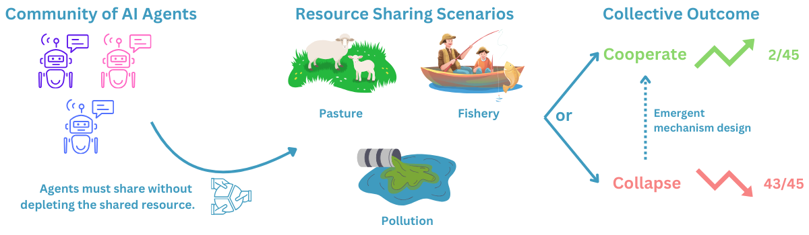

# GovSim: Governance of the Commons Simulation




<p align="left">Fig 1: Illustration of the GOVSIM benchmark. AI agents engage in three resource-sharing scenarios: fishery, pasture, and pollution. The outcomes are cooperation (2 out of 45 instances) or collapse (43 out of 45 instances), based on 3 scenarios and 15 LLMs.
</p>

This repository accompanies our research paper titled "**Cooperate or Collapse: Emergence of Sustainable Cooperation in a Society of LLM Agents**" 

#### Our paper:

"**[Cooperate or Collapse: Emergence of Sustainable Cooperation in a Society of LLM Agents](https://arxiv.org/abs/2404.16698)**" by *Giorgio Piatti\*, Zhijing Jin\*, Max Kleiman-Weiner\*, Bernhard Schölkopf, Mrinmaya Sachan, Rada Mihalcea*.

**Citation:**

```bibTeX
@misc{piatti2024cooperate,
      title={Cooperate or Collapse: Emergence of Sustainable Cooperation in a Society of LLM Agents}, 
      author={Giorgio Piatti and Zhijing Jin and Max Kleiman-Weiner and Bernhard Schölkopf and Mrinmaya Sachan and Rada Mihalcea},
      year={2024},
      eprint={2404.16698},
      archivePrefix={arXiv},
      primaryClass={cs.CL}
}
```


## Simulation

Each experiment is defined by hydra configuration. To run an experiment, use 
`python3 -m simulation.main experiment=<scenario_name>_<experiment_name>`.
For example, to run the experiment `fish_baseline_concurrent` , use
`python3 -m simulation.main experiment=fish_baseline_concurrent`. See below for the list of experiments and their ids.

```
python3 -m simulation.main experiment=<experiment_id> llm.path=<path_to_llm>
```


### Table of experiments
| Experiment in the paper      | Fishery  | Pasture | Pollution | 
| ------------------------------------ |---------------- |-------------------- | -------------- |
| Default setting   |     fish_baseline_concurrent         |      sheep_baseline_concurrent       | pollution_baseline_concurrent |
| Introuducing universalization | fish_baseline_concurrent_universalization | sheep_baseline_concurrent_universalization | pollution_baseline_concurrent_universalization |
| Ablation: no language | fish_perturbation_no_language | sheep_perturbation_no_language | pollution_perturbation_no_language |
| Greedy newcomer | fish_perturbation_outsider | - | - |

## Subskills

To run the subskill evaluation, use the following command:

```
python3 -m subskills.<scenario_name> llm.path=<path_to_llm>
```

## Supported LLMs
In principle, any LLM model can be used. We tested the following models:

*APIs:*
- OpenAI: `gpt-4-turbo-2024-04-09`, `gpt-3.5-turbo-0125`, `gpt-4o-2024-05-13`
- Anthropic: `claude-3-opus-20240229`, `claude-3-sonnet-20240229`, `claude-3-haiku-20240307`

*Open-weights models:*
- Mistral: `mistralai/Mistral-7B-Instruct-v0.2`, `mistralai/Mixtral-8x7B-Instruct-v0.1`
- Llama-2: `meta-llama/Llama-2-7b-chat-hf`, `meta-llama/Llama-2-13b-chat-hf`, `meta-llama/Llama-2-70b-chat-hf`
- Llama-3: `meta-llama/Meta-Llama-3-8B-Instruct`, `meta-llama/Meta-Llama-3-70B-Instruct`
- Qwen-1.5: `Qwen/Qwen1.5-72B-Chat-GPTQ-Int4`, `Qwen/Qwen1.5-110B-Chat-GPTQ-Int4`


For inference we use the `pathfinder` library. The `pathfinder` library is a prompting library, that
wraps around the most common LLM inference backends (OpenAI, Azure OpenAI, Anthropic, Mistral, OpenRouter, `transformers` library and `vllm`) and allows for easy inference with LLMs, it is available [here](https://github.com/giorgiopiatti/pathfinder). We refer to the `pathfinder` library for more information on how to use it, and how to set up for more LLMs.


## Code Setup
To use the codes in this repo, first clone this repo:
    

    git clone --recurse-submodules https://github.com/giorgiopiatti/GovSim.git
    cd govsim

Then, to install the dependencies, run the following command if you want to use the `transformers` library only.
    
```setup
bash ./setup.sh
```

or if you want to use the `vllm` library, run the following command:

```setup
bash ./setup_vllm.sh
```

Both setups scripts require conda to be installed. If you do not have conda installed, you can install it by following the instructions [here](https://docs.conda.io/projects/conda/en/latest/user-guide/install/index.html).

### Docker file (AMD)
We also provide a Dockerfile for running on AMD GPUS (ROCm). We do not offer support for this Dockerfile, but it can be used as a reference for running on AMD GPUs.

```bash
docker build -t govsim -f ./govsim-rocm.dockerfile . 
```


